# Contents 📋
1. [TL;DR 💡](#tldr-)
2. [Introduction 🌱](#introduction-)
    - [Key Concepts](#-key-concepts-)
3. [PRM & the Arm Robot 🤖](#prm--the-arm-robot-)
4. [RRT & the (very very very abstract & symbolic) Car Robot 🛼](#rrt--the-very-very-very-abstract--symbolic-car-robot-)
5. [Code Design & Implementation 🛠️](#code-design--implementation-%EF%B8%8F)
    - [PRM Implementation](#-prm-implementation-)
    - [RRT Implementation](#-rrt-implementation-)
6. [Testing 🔍](#testing-)
    - [PRM Demo](#-prm-demo-)
    - [RRT Testing](#-rrt-testing-)
7. [Conclusion 🌿](#conclusion-)

# TL;DR 💡
This report is running so much longer than I expected it to so here are a few salient points:

- PRM & RRT algorithms for robotic motion planning
- While implementing RRT I encountered the common problem of the search tree getting stuck in various places due to obstacles and narrow passages. To address this, I implementing an **unstuck()** function which briefly samples points in different directions to continue exploration. 🌟
    - See [RRT Testing](#rrt-testing) for details; this is probably the most interesting part of the report.
- Testing has indicated that the above fix works!
- COSC 76 is very fun. If you're at Dartmouth, take it!

# Introduction 🌱
In fall of 2023 I took COSC 76/COGS 44: Artificial Intelligence at Dartmouth College, where I read about and implemented various algorithms designed to solve computational problems vaguely related to artificial intelligence. This here is a cleaned-up version of our final project: **PRM & RRT for robotic motion planning** 🔧🤖.

It is currently spring of 2024, and since then I've taken an actual algorithms class. Though I find myself wishing I'd waited until after I've learned algorithms to take Artificial Intelligence (in hindsight there's a lot more I could've learned if only I had an understanding of more basic things to scaffold upon), this nevertheless remains a part of my academic journey that has inspired me very much, and I'm quite proud of it. I would love to do something algorithms-related in the future.

My original code and report can be found [here](https://github.com/yawenx2004/dart-cosc076/tree/main/ps7-prm-rrt). Updates are as below—
- Reduced repetition
- Restructured RRT so that RRT_unstuck has as few changed functions from RRT as possible, ensuring the changes reflect (and _only_ reflect) how exactly the unstuck process works
- Ensured RRT_unstuck returns to using the original goal for guidance for a useful chunk of time instead of constantly changing goals

### 🌟 Key Concepts 🌟
**Robotic motion planning** is an artificial intelligence problem where we generate a sequence of valid configurations that allows a robot to move from an initial state to a goal state in an environment, while avoiding collisions. Two examples of robotic motion planning algorithms are PRM and RRT, both of which involve randomly sampling a configuration space.

- **Probabilistic roadmap (PRM):** connects randomly-sampled valid configurations in the environment and connects them to form a network, then searches through the network to find a path.
- **Rapidly-exploring Random Tree (RRT):** builds a tree by randomly sampling points in the configuration space; each new randomly-sampled node is connected to the nearest node on the tree.

Both of these algorithms involve **discretizing a continuous search space**, a topic I first encountered in this class and have been fascinated by ever since.

Now that we've defined the algorithms, let's move on to the specific implementations in this project.

# PRM & the Arm Robot 🤖

- **Input:**
    - **robot**, in this case a 2D planar arm consisting of n lines
    - **obstacles**, represented as 2D polygons
    - **start configuration**, represented as an n-array, each element indicating the angle of a section of the robotic arm
    - **goal configuration**, similar to start configuration
- **Output**: sequence of valid arm configurations that allow the arm to move from start to goal, without bumping into obstacles

# RRT & the (very very very abstract & symbolic) Car Robot 🛼

Imagine the car is just a dot.

- **Input:**
    - **environment**, here a 2D plane filled with obstacles represented as 2D polygons
    - **start point**, somewhere within the environment
    - **goal point**, somewhere else within the environment
- **Output:** a path from the start to the end that avoids collision with obstacles

# Code Design & Implementation 🛠️
As of 22 April 2024 I have rewritten the code from last fall; you can find them [here](/PRM) (PRM) and [here](/RRT) (RRT). Original code is [here](https://github.com/yawenx2004/dart-cosc076/tree/main/ps7-prm-rrt).

**Note:** We are using the intersects() function of the shapely library to check for collisions, and using matplotlib to visualize. Search/solve is done through a simple BFS.

### 🌟 PRM Implementation 🌟
Code [here](https://github.com/yawenx2004/dart-cosc076/tree/main/portfolio/PRM).

Our PRM has three parts—ArmRobot.py to represent the arm robot, PRM.py which houses the actual PRM implementation, and PRMSolver.py which uses BFS to search the PRM graph and find a solution.

#### ArmRobot.py:

- **__init__()** takes parameters num_joints (number of joints/links the robotic arm has) and start_config (starting angle for each joint); initially sets self.config to start_config
- **forward_kinematics()** calculates the Cartesian location of each joint given the angle specified in its configuration
- **collids_with()** uses the intersects() function of the shapely library to check for collision between a given configuration and a given set of obstacles

#### PRM.py:

- **__init__()** takes an ArmRobot instance, a goal configuration, and a list of obstacles as its parameters, as well as values k (max edges each vertex can have in the roadmap) and num_samples (number of vertices the roadmap will have)
- **sample()** randomly selects valid configurations (that is, configurations that do not result in the arm passing through obstacles); these form the vertices of the roadmap
- **add_edges()** loops through the configurations sampled, and for each vertex v it looks at k nearest neighbors and adds an edge from v to its neighbor if you can go from v to that neighbor without colliding into an obstacle
    - **get_neighbors()** returns k nearest neighbors using a KD tree
    - **is_collision()** checks for collisions using linear interpolation
- **get_roadmap()** runs sample(), runs add_edges(), thus generating and returning the PRM roadmap (alongside the start and goal configurations)
- **visualize()** animates the path—if we find one—by plotting frame-by-frame each step in the path

#### PRMSolver.py:
PRMSolver.py runs get_roadmap() to get the roadmap, then runs BFS on edges to find the shortest path from the start to the goal within the roadmap. Animates the path, too, with the visualize() function described above, if that optional parameter to do so is toggled on.

PRM *done*! 🎉

Onto RRT.

### 🌟 RRT Implementation 🌟
Code [here](https://github.com/yawenx2004/dart-cosc076/tree/main/portfolio/RRT).

RRT also involves a BFS solver. Let's break down the other functions here. Visualization done with matplotlib.

#### RRT.py

- **__init__()**  takes as parameters start, goal, environment, and step_size defaulted to 5; we also initialize empty arrays for vertices and edges for the RRT tree
    - **start** and **goal** are represented as points (x, y)
    - **env** is represented as a two-tuple ((width, height), [array of obstacles])
        - each obstacle is represented as an array of points, each point representing the coordinates for one corner of the obstacle
- **grow_tree()** grows the RRT tree until it reaches the goal; it does so by 1) select_vertex(), 2) randomly generating a direction theta, 3) and add_vertex()
    - **select_vertex()** loops through all vertices on the tree and returns the one with the minimum Euclidean distance from the goal
    - **add_vertex()** takes as parameters the vertex as returned by select_vertex and the aforementioned random theta, then calculates a new vertex step_size from the selected vertex in the direction of theta; if the path from the selected vertex to the new vertex does _not_ intersect any obstacle, it adds the new vertex to the tree and returns True for bookkeeping; otherwise it returns False
- **solve()** just grows the tree and runs BFS on it to get the path

#### RRT_unstuck.py
Subclass of RRT. Detects when RRT gets stuck, and when stuck handles it by temporarily shifting the goal so the tree temporarily explores a new direction.

- **__init__()**, in addition to RRT's __init__(), also creates attributes real_goal (to keep track of the actual goal when the goal shifts), fake_goal_moves and real_goal_moves (to keep track of the number of moves made in the direction of either the actual goal or a temporary goal), and stability (minimum amount of steps toward each goal before we shift goals again)
- **stuck()** returns True when RRT gets stuck; it defines stuck-ness as continuously growing new vertices sourced from the same vertex, and therefore takes the most recent 20 vertices in the tree and checks if there exists a vertex that appears in at least 10 edges
- **grow_tree()** is changed to incorporate **stuck**—with every new vertex added, we check whether or not RRT has gotten stuck; if stuck, we randomly generates a new goal and grows 20 new vertices in the direction of that goal before reverting back to the original goal

#### RRT_control.py
Here we just change **select_vertex()** to return a random vertex instead of the vertex closest to the goal. We use this as a control to test the effectiveness of our RRT implementations.

# Testing 🔍
### 🌟 PRM Demo 🌟
In test_prm.py I have written several test cases for an 2R planar robot and a 4R planar robot (this one with environments of varying difficulty). To select the test case, just comment out lines as specified in the test_prm.py file. If you run test_prm.py without making any changes, you should see, alongside from the solution in the console, a matplotlib animation of an arm moving from the start to the goal configuration.

#### Case 1: 2R arm robot
First, let's take a look at the 2R test case. In the 2R case, configurations are 2-vectors and can therefore be mapped onto 2D space. Below you can see the graph that represents the PRM roadmap. Vertices represent possible configurations (red = start; yellow = goal), and edges represent the possibility of going between two configurations without collision.

The roadmap PRM uses to search through:


The shortest path from the red vertex to the yellow vertex represents the solution.

```
Solution found after searching 4414 nodes!
---
PATH: [(85, 0), (110.29536799915928, 161.16394618103706), (200, 350)]
LENGTH: 3
```

Let's look at the same problem visualized another way. Here, red polygons represent obstacles, the red configuration represents the start configuration, the yellow configuration represents the goal configuration, and the blue ones represent every configuration sampled.

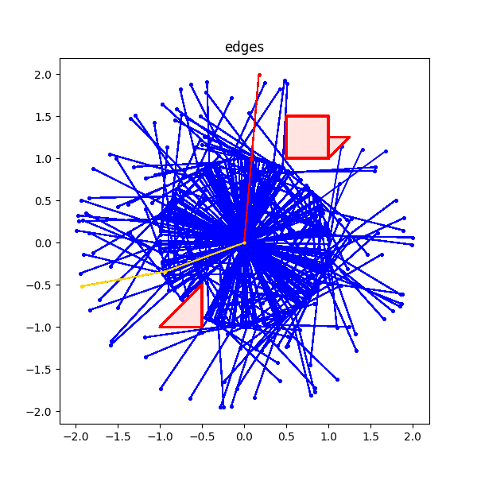

#### Case 2: 4R arm robot
Now let's take a look at higher-dimensional problems. For the hardest 4R problem (environment and generated configurations pictured below), PRM returned the following output—

```
Solution found after searching 938 nodes!
---
PATH: [(0, 0, 0, 300), (132.56911930250288, 218.5923196635714, 219.15960059395246, 237.24818972150314), (210, 330, 90, 75)]
LENGTH: 3
```

A visualization of the problem—


**Note:** This test case runs in about 15 seconds if you choose not to visualize the output, but due to matplotlib loading time, if you do choose to visualize, it will take quite a bit longer.

### 🌟 RRT Testing 🌟
For RRT testing we have 5 environments pictured below. Since the control fails to find a solution for any of the environment within a reasonable time—the tree clusters heavily around the starting point and takes very long to explore the environment—we test each environment on RRT and RRT_unstuck (with stability 5, 20,and 40), and compare performance. We operationalize speed as having a smaller tree with fewer vertices. This means the algorithm has found the end early and can then terminate.

Unfortunately I do not have records of runtime. Especially with matplotlib visualization, though, running RRT could take quite a while—environment 4 problems have taken RRT_stuck() 🚧 minutes to solve.

I did once leave RRT_control to run for maybe 2 hours in the obstacle-less space and it still fails to find a path. It did spread to about (40, 40), but the goal is located at (100, 100) and moreover the more the control grows, the slower it goes—it sticks to areas that are already densely clustered since there is a greater probability of selecting points in these areas.

Control clustering, after about 10 minutes (it's not much different after 2 hours):

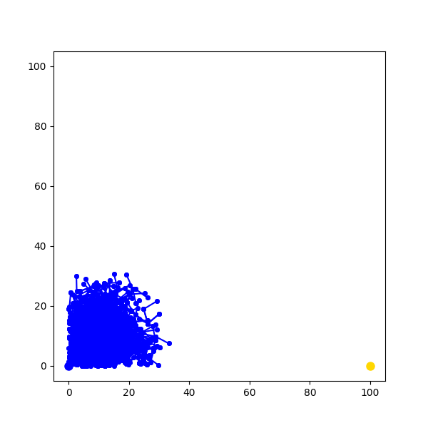

#### Environment 0: no obstacle
In terms of efficiency, RRT outperforms RRT_unstuck almost every time—it builds the tree faster, using fewer vertices. RRT is on average 68% faster than RRT_unstuck (stability 40). This is quite significant an advantage, particularly when it comes to large graphs. So, in an obstacle-less environment, RRT wins.

In RRT_unstuck, stability of 40 seems to have a bit of an advantage. This is consistent with the finding that RRT performs best. RRT_unstuck (stability 40), by limiting exploration, mimics RRT more so than the lower-stability versions.

```
Values in the table represent the number of vertices in the tree this specific instance of RRT has built.

| trial  | RRT             | RRT_unstuck (5)  | RRT_unstuck (20) | RRT_unstuck (40) |
| ------ | --------------- | ---------------- | ---------------- | ---------------- |
| 1      | 67              | 132              | 111              | 154              |
| 2      | 64              | 86               | 110              | 79               |
| 3      | 49              | 129              | 113              | 94               |
| 4      | 62              | 96               | 112              | 95               |
| 5      | 49              | 91               | 77               | 105              |
| 6      | 74              | 106              | 112              | 89               |
| 7      | 67              | 113              | 114              | 101              |
| 8      | 53              | 88               | 90               | 73               |
| 9      | 67              | 111              | 124              | 104              |
| 10     | 59              | 88               | 85               | 70               |
| ------ | --------------- | ---------------- | ---------------- | ---------------- |
| mean   | 61.1            | 104              | 104.8            | 96.4             |
| median | 61.5            | 101              | 111.5            | 94.5             |
```

Sample RRT solution:

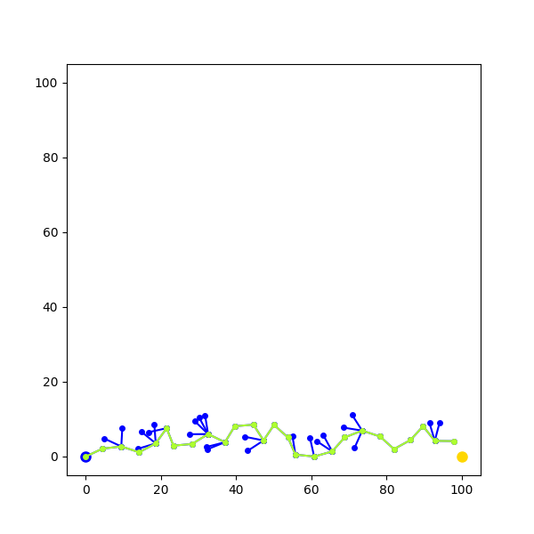

Sample RRT_unstuck (5) solution:

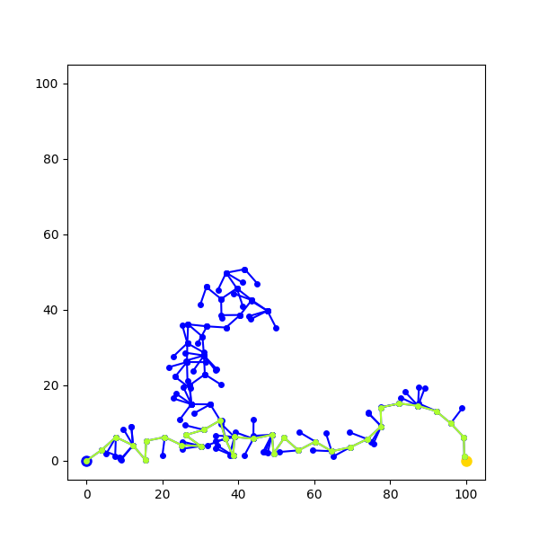

Sample RRT_unstuck (20) solution:

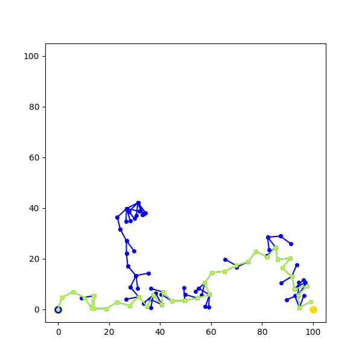

Sample RRT_unstuck (40) solution:

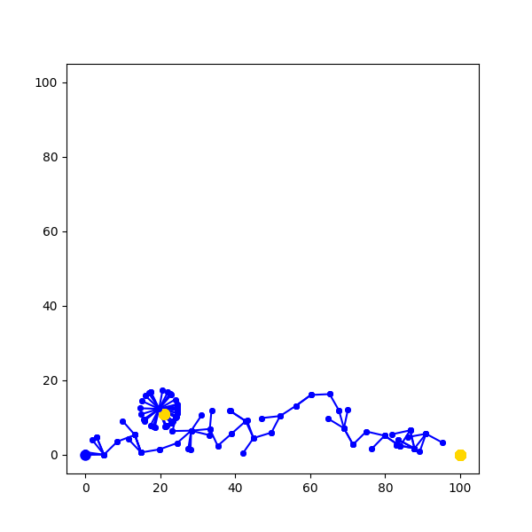

#### Environment 1: low wall
Very quickly the advantages of RRT_unstuck begin to show. Although RRT takes about half the time taken by RRT_unstuck to find a path, this only applies when RRT is actually able to vault over the obstacle. In 60% of the trials RRT gets stuck behind the obstacle and begins to grow points ad infinitum in the same tiny section of the search space. It gets stuck forever, effectively. These are the trials labeled as FAILURE in the table below.

```
Values in the table represent the number of vertices in the tree this specific instance of RRT has built.

| trial  | RRT             | RRT_unstuck (5)  | RRT_unstuck (20) | RRT_unstuck (40) |
| ------ | --------------- | ---------------- | ---------------- | ---------------- |
| 1      | 78              | 175              | 156              | 91               |
| 2      | 67              | 260              | 148              | 86               |
| 3      | FAILURE         | 139              | 106              | 189              |
| 4      | FAILURE         | 140              | 154              | 182              |
| 5      | 50              | 123              | 129              | 120              |
| 6      | FAILURE         | 242              | 196              | 229              |
| 7      | FAILURE         | 153              | 214              | 85               |
| 8      | FAILURE         | 203              | 257              | 88               |
| 9      | FAILURE         | 92               | 167              | 70               |
| 10     | 65              | 90               | 125              | 131              |
| ------ | --------------- | ---------------- | ---------------- | ---------------- |
| mean   | 65*             | 161.7            | 155.2            | 127.1            |
| median | 66*             | 139.5            | 155              | 105.5            |

*technically infinite, given multiple instances of failure
```

Sample RRT solution:


Sample RRT_unstuck (5) solution:


Sample RRT_unstuck (20) solution:


Sample RRT_unstuck (40) solution:


RRT failure:

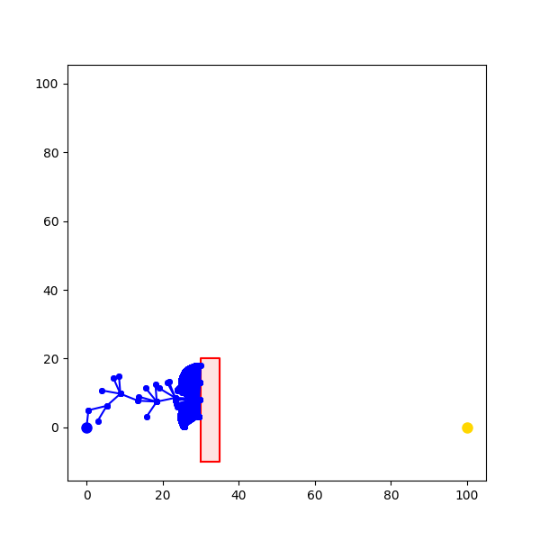

#### Environment 2: high wall 🚧
Here is where RRT fails to find a path at all.
```
Values in the table represent the number of vertices in the tree this specific instance of RRT has built.

| trial  | RRT             | RRT_unstuck (5)  | RRT_unstuck (20) | RRT_unstuck (40) |
| ------ | --------------- | ---------------- | ---------------- | ---------------- |
| 1      | FAILURE         | 506              | 354              | 608              |
| 2      | FAILURE         | 567              | 254              | 188              |
| 3      | FAILURE         | 748              | 300              | 192              |
| 4      | FAILURE         | 371              | 329              | 520              |
| 5      | FAILURE         | 745              | 463              | 612              |
| ------ | --------------- | ---------------- | ---------------- | ---------------- |
| mean   | FAILURE         | 587.4            | 340              | 424              |
| median | FAILURE         | 567              | 329              | 520              |
```

Sample RRT_unstuck (5) solution:

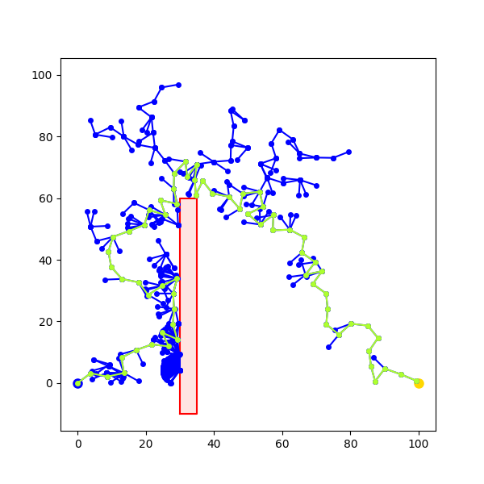

Sample RRT_unstuck (20) solution:

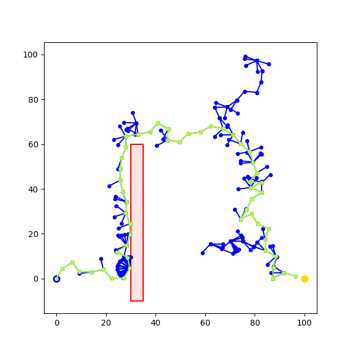

Sample RRT_unstuck (40) solution:

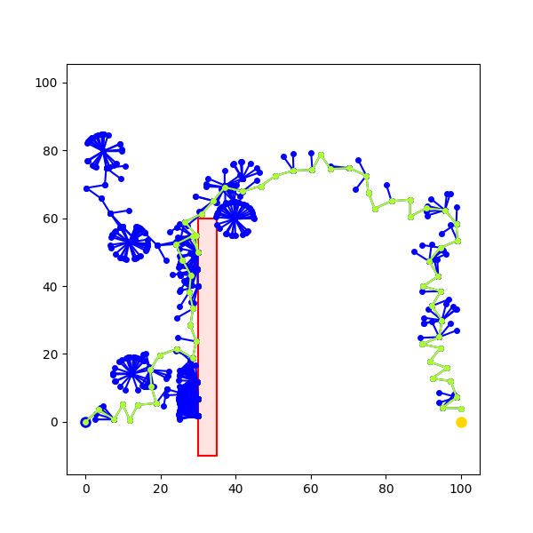

#### Environment 3: two narrow passages 🚧
```
| trial  | RRT                       | RRT_unstuck (20)          | RRT_unstuck (40)          |
| ------ | vertices    | path length | vertices    | path length | vertices    | path length |
| ------ | ----------- | ----------- | ----------- | ----------- | ----------- | ----------- |
| 1      | FAILURE     | FAILURE     | 442         | 67          | 606         | 56          | 406 64
| 2      | FAILURE     | FAILURE     | 788         | 78          | 380         | 62          | 420 63
| 3      | FAILURE     | FAILURE     | 661         | 56          | 545         | 54          | 318 47
| 4      | FAILURE     | FAILURE     | 547         | 69          | 1105        | 56          | 257 51
| 5      | FAILURE     | FAILURE     | 492         | 60          | 372         | 56          | 268 56
| ------ | ----------- | ----------- | ----------- | ----------- | ----------- | ----------- |
| mean   | FAILURE     | FAILURE     | 586         | 66          | 601.6       | 56.8        | 333.8
| median | FAILURE     | FAILURE     | 547         | 67          | 545         | 56          | 318
```

Sample RRT_unstuck (20) solution:

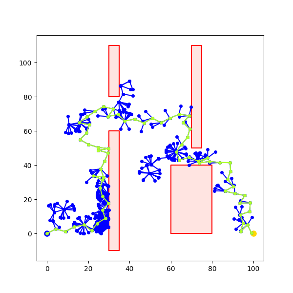

#### Environment 4: multiple narrow passages 🚧
```
| trial  | RRT                       | RRT_unstuck (20)          | RRT_unstuck (40)          |
| ------ | vertices    | path length | vertices    | path length | vertices    | path length |
| ------ | ----------- | ----------- | ----------- | ----------- | ----------- | ----------- |
| 1      | FAILURE     | FAILURE     | 1204        | 77          | 673         | 74          | 749  79
| 2      | FAILURE     | FAILURE     | 1419        | 76          | 1945        | 80          | 1180 84
| 3      | FAILURE     | FAILURE     | 2566        | 90          | 1432        | 73          | 973 68
| 4      | FAILURE     | FAILURE     | 1084        | 74          | 850         | 79          | 667 76
| 5      | FAILURE     | FAILURE     | 1773        | 74          | 1794        | 78          | 1390 72
| ------ | ----------- | ----------- | ----------- | ----------- | ----------- | ----------- |
| mean   | FAILURE     | FAILURE     | 1419        | 78.2        | 1338.8      | 76.8        | 937.8
| median | FAILURE     | FAILURE     | 1609.2      | 76          | 1432        | 78          | 973
```

Sample RRT_unstuck (20) solution:

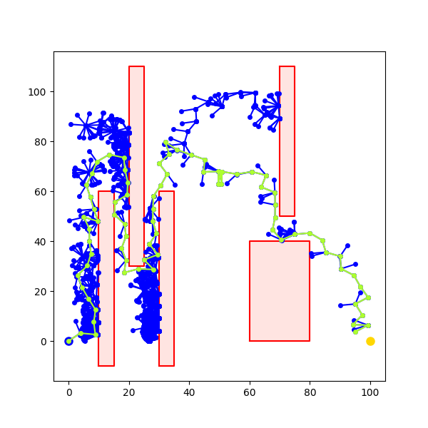

Sample RRT_unstuck (40) solution:

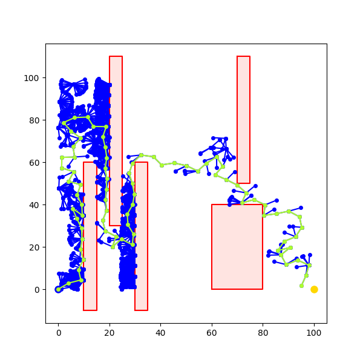

#### Conclusion
🚧 RRT_unstuck exploration vs. persistence tradeoff; exploration in narrow passages but in open spaces persistence is helpful

🚧 RRT_control will probably _eventually_ find a path given infinite time

# Conclusion 🌿
🚧
