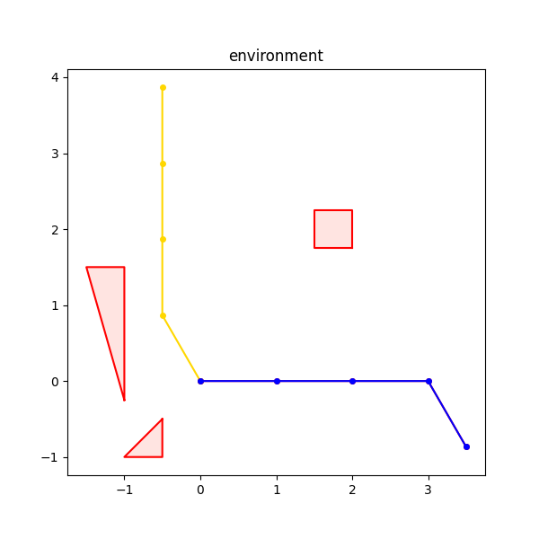

For a demonstration of the PRM code, go to test_prm.py. The following test cases have been written out for you:

- a simple 2R robot problem
- three 4R robot problems with varying levels of difficulty

Problems (starting configurations in blue, goal configurations in gold):

\
\
Just comment in/out the appropriate functions to test each. Adjust PRM k-values and number of samples on lines 12, 20, 21, and 22.\
\
Each time you run BFSSolver.solve(), the output should be a visualization of the environment. Exit out of the matplotlib window, and the PRM algorithm will begin to run. If a path has been found, it will be displayed in the console, and visualized.
