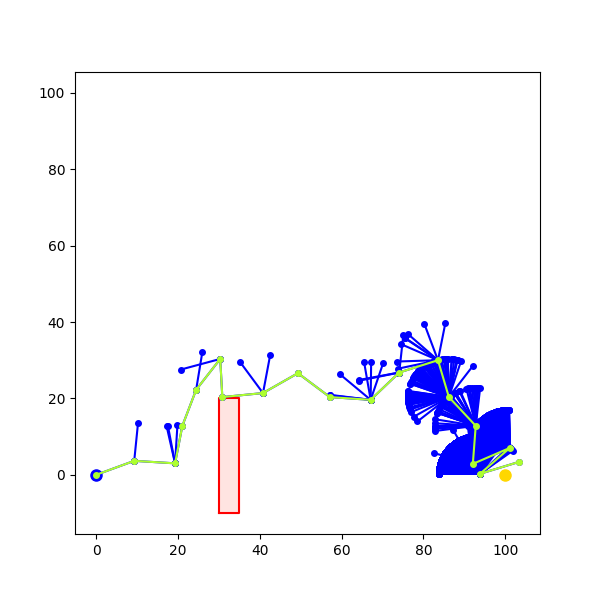

Yawen Xue\
COGS 44\
PS7 - robot motion planning\
11 Nov. 23

# Intro
See README.md for running instructions.
## PRM and the arm robot
In the arm robot problem, we are given a planar arm robot and a series of obstacles, and try to find a path from the arm's starting configuration to a goal configuration. The arm must not bump into any obstacles along its path.\
\
Here we are given a continuous search space — each of the arm robot's joints could be at any angle between 0 and 360 degrees (a continuous, infinite set of points). However, since a continuous search space contains infinite possible search nodes, we must discretize it.\
\
Here is where PRM comes in. In PRM, we randomly sample configurations and draw edges between valid ones (that is, those that do not result in collisions with obstacles). This gives us a graph, which we then use BFS to search through, and with BFS we can find the shortest path between the starting configuration and the goal configuration.\
\
PRM is a complete algorithm. That is, as sample space tends toward infinity, the possibility that a solution is found (if it exists) becomes 1.
# Code Design and Implementation
## Robot.py
This models the planar arm. Each Robot object takes in as parameters the number of joints and a starting configuration. Its state — self.config — is represented by a list of angles, each angle denoting the angle of one of the joints. The forward_kinematics() function gives the Cartesian location of each joint given its angular configuration. The collides_with() function uses shapely to check whether or not a specific configuration results in a collision with a list of obstacles. It does this by instantiating, at each configuration, each link of the robot arm as a LineString. Then, it calls on the intersects() function for each obstacle polygon in the provided list of obstacle polygons.
## PRM.py
The PRM algorithm, as well as the environment in the problem (i.e. robot, goal, obstacles), are set up here.\
\
We implemented k-PRM specifically. That is, we connect each sampled milestone to its k nearest neighbors. Here is how it works —

- sample() - We use randint to generate a random configuration of joint angles, check for non-collision, and use these as potential vertices for the roadmap. After sampling a specific number of points (defaulted to 1000), we build a KD tree from the points. This helps us select the nearest neighbors to any given vertex, and will be useful in the nearest_k_neighbors() function.
- collision_checker() - We use linear interpolation. From scipy I imported interp1d, [TODO]
- add_edges() - [TODO]
- nearest_k_neighbors() - [TODO]

The get_roadmap() function wraps it up by running sample() and add_edges() until we get an array of edges (basically a graph) that contains the start and goal configurations.\
\
The second half of the code consists of matplotlib visualization.
## BFSSolver.py
This is the final step. I chose to run BFS because my PRM algorithm generates quite a large graph, and BFS is guaranteed to find the shortest path if one exists. The BFS algorithm takes in the start configuration, the goal configuration, and the list of edges. It converts that list into a dictionary, then uses a queue to pathfind.\
\
Run solve() and we end up with a path from the start configuration to the goal figuration, if such a path exists (and has been included in the PRM roadmap previously).\
\
Output —

- visualizes environment
- looks for path
- if path found, animates path and outputs some information

# Testing
I ran PRM on 2R, 3R, and 4R robots with various start and goal configurations as well as various obstacles. Here are four selected test cases; you can also find them in test_prm.py:
## 2R robot testing
environment:
\
\
solution (k=5, num_samples=5000):

## 4R robot testing
environment:
\
\
solution (k=5, num_samples=5000):
\
\
solution (k=100, num_samples=1000):

## 4R* (harder 4R) robot testing
environment:
\
\
solution (k=100, num_samples=1000):

## 4R** (hardest 4R) robot testing
environment:
\
\
solution (k=100, num_samples=1000):

## Summary:
Table of output with k=5 and num_samples = 5000 (default); numbers represent number of steps in output path and 4R* and 4R** are the harder 4R problems:
<pre>
k=5
num_samples=5000
| robot | trial 1 | trial 2 | trial 3 |
| ----- | ------- | ------- | ------- |
| 2R    | 72      | 76      | 71      |
| 4R    | 20      | n/a     | n/a     |
| 4R*   | n/a     | 18      | n/a     |
| 4R**  | n/a     | n/a     | n/a     |
</pre>
As we can see, this setup only returns a solution for the problem 1 out of 3 trials (actually less — I ran a few trials before officially recording). Yet, based on the outputted found configurations below, paths are possible.\
\
Figure:
\
\
The problem, therefore, is that there isn't enough connectivity — intuitively there are obviously paths between some of these configurations, but the algorithm does not find them. So, I ran PRM again with k set to 100 and num_samples set to 1000. This results in much greater connectivity, and therefore much shorter (and more direct) paths. More importantly, now the algorithm actually finds a solution for the 4R robot case most of the time.
<pre>
k=100
num_samples=1000
| robot | trial 1 | trial 2 | trial 3 |
| ----- | ------- | ------- | ------- |
| 2R    | 7       | 7       | 7       |
| 4R    | 4       | 4       | 4       |
| 4R*   | 5       | 5       | 5       |
| 4R**  | 5       | 5       | 5       |
</pre>
Next, I ran the tests with num_samples set to 200 in order to decrease runtime. From the 5 trials I ran, this doesn't seem to decrease performance too much (paths still found), and it effectively decreases runtime.
<pre>
k=100
num_samples=200
| robot | trial 1 | trial 2 | trial 3 |
| ----- | ------- | ------- | ------- |
| 2R    | 2       | 3       | 3       |
| 4R    | 3       | 3       | 3       |
| 4R*   | 3       | 4       | 4       |
| 4R**  | 3       | 3       | 3       |
</pre>
# Conclusion
In conclusion, increasing the value of k (and subsequently the connectivity of the graph) increases the likelihood of a path being found. I set the new default k to 100. I also set the default num_samples values to 300.\
\
Although, k=3 does result in more satisfying animations.\
\
I'm quite confident in the ability of my PRM function — as shown in the 4R** problem, it's able to find a path that requires extensive folding of the robot arm. None of its paths result in collisions.
# Extensions
I decided to implement RRT. In the interest of time and my very limited understanding of kinematics, I decided to eschew angular and linear velocity, and focused on just growing the tree and exploring it. The path I will return is just a sequence of equidistant Cartesian coordinates; if you want theta to be in the robot's configuration.\
\
RRT works by growing a tree in the direction of the goal, then traversing that tree. This is my implementation —

- grow_tree() grows the tree by running sample() and add_vertex() until goal_reached() returns true
- sample() selects a random point within the environment
- add_vertex() takes that point, runs select_best_vertex() to get the starting vertex, then adds to the tree the vertex that is step_size units away from the vertex and in the direction of the random point generated by sample, provided that collision() returns false
- is_collision() basically uses shapely to check for collisions between a path from one vertex to another and all the obstacles
- solve() runs grow_tree(), then runs bfs_on_edges() to find the fastest path through that tree
- and here's our output!

However, this implementation gets stuck very easily when obstacles are present. I made RRT2 extend RRT, and here are changes I've made —

- stuck() is a function that calculates whether or not we've been stuck by taking the last 20 edges and checking if any vertex returns more than 10 times
- grow_tree() runs stuck() each time we attempt to add a vertex
- if stuck, we temporarily set the goal to a random new direction for 10 steps so that the tree could grow in a different direction, then we change the goal back to the real goal
- sample() has also been edited to return an angle instead of a point, and therefore add_vertex() modified accordingly

Basically these are the changes, in practical terms —

- If we get stuck at an obstacle, we temporarily set a random new goal to grow the tree in a new direction.
- Since the closest we get to a corner, the less likely the original sample() method is going to pick a point that will lead us into that corner, I changed sample() so that it chooses an angle value instead. This avoids fan formations (as you'll see in my outputs below).

I had 4 environments. Test cases below:
Environment 0:
Solution (RRT):
\
\
Solution(RRT2):
\
\
Environment 1:
Solution (RRT):
\
\
Solution(RRT2):
\
\
Environment 2:
Solution(RRT2):
\
\
Environment 3:
Solution(RRT2):
\
\
Environment 4:Solution(RRT2):
\
\
Summary of tests here —\
\
Environment 0 (no obstacles):
<pre>
| trial | rrt                 | rrt2                |
| ----- | vertices | length   | vertices | length   |
| ----- | -------- | -------- | -------- | -------- |
| 1     | 62       | 20       | 65       | 34       |
| 2     | 336      | 18       | 59       | 30       |
| 3     | 62       | 18       | 1201     | 32       |
| 4     | 128      | 21       | 62       | 34       |
| 5     | 498      | 17       | 57       | 29       |
| ----- | -------- | -------- | -------- | -------- |
| avg   | 217.2    | 18.8     | 288.8    | 31.8     |
| med   | 128      | 18       | 62       | 32       |
</pre>
As we can see, in this environment, RRT always returns the shorter path. RRT2 usually returns the smaller tree, but one outlier (a graph that sprawls in every direction due to the randomization I added in) pulled up the average significantly. So, though usually RRT2 finds the smaller tree since it doesn't get stuck like RRT does, RRT still has a slight advantage here.\
\
Onto environment 1 (short bar obstacle):
<pre>
| trial | rrt                 | rrt2                |
| ----- | vertices | length   | vertices | length   |
| ----- | -------- | -------- | -------- | -------- |
| 1     | 219      | 22       | 78       | 32       |
| 2     | 280      | 22       | 75       | 35       |
| 3     | 210      | 14       | 109      | 41       |
| 4     | 225      | 17       | 6178     | 40       |
| 5     | 266      | 17       | 1539     | 47       |
| ----- | -------- | -------- | -------- | -------- |
| avg   | 240      | 18.4     | 1715.8   | 39       |
| med   | 225      | 17       | 75       | 40       |
</pre>
Same effect as environment 0. Though RRT2 has the smaller median graph, its mean is much higher, and its paths returned are less straightforward. Here, RRT wins again.\
\
The last graph returned looks like this. As you can see, there are many unnecessary points:
\
\
Onto environment 2, similar to 1 but with a longer bar:
<pre>
| trial | rrt                 | rrt2                |
| ----- | vertices | length   | vertices | length   |
| ----- | -------- | -------- | -------- | -------- |
| 1     | n/a      | n/a      |
| 2     | n/a      | n/a      |
| 3     | n/a      | n/a      |
| 4     | n/a      | n/a      |
| 5     | n/a      | n/a      |
| ----- | -------- | -------- | -------- | -------- |
| avg   | n/a      | n/a      |
| med   | n/a      | n/a      |
</pre>
Here's where the advantages of RRT2 comes in. With actual relevant obstacles, RRT is unable to find a path. It gets stuck in the exact same spot and stays there forever. RRT2, however, is able to get unstuck.\
\
RRT getting stuck:
\
\
We move on to environment 3:
<pre>
| trial | rrt                 | rrt2                |
| ----- | vertices | length   | vertices | length   |
| ----- | -------- | -------- | -------- | -------- |
| 1     | n/a      | n/a      | 4858     | 70       |
| 2     | n/a      | n/a      | 1356     | 54       |
| 3     | n/a      | n/a      | 339      | 51       |
| 4     | n/a      | n/a      | 419      | 71       |
| 5     | n/a      | n/a      | 537      | 57       |
| ----- | -------- | -------- | -------- | -------- |
| avg   | n/a      | n/a      | 913.2    | 63.6     |
| med   | n/a      | n/a      | 262      | 61       |
</pre>
Finally, environment 4, with the narrow corridors to pass through:
<pre>
| trial | rrt                 | rrt2                |
| ----- | vertices | length   | vertices | length   |
| ----- | -------- | -------- | -------- | -------- |
| 1     | n/a      | n/a      | 3541     | 81       |
| 2     | n/a      | n/a      | 1134     | 78       |
| 3     | n/a      | n/a      | 1081     | 79       |
| 4     | n/a      | n/a      | 4442     | 84       |
| 5     | n/a      | n/a      | 1271     | 77       |
| ----- | -------- | -------- | -------- | -------- |
| avg   | n/a      | n/a      | 1493.8   | 79.8     |
| med   | n/a      | n/a      | 1271     | 79       |
</pre>
All in all, I'm fairly confident in my RRT2 implementation. It's able to find a path through narrow corridors and sprawl all over the map. For further improvements I'd like to implement path smoothing so that it can have the RRT advantage of more direct paths.\
\
I ran a couple of cursory trials on RRTControl (which is not RRT at all — you just return any random vertex to build the path from). As expected, RRT and RRT2 both vastly outperform it. as RRTControl just clusters in one space and takes a very long time to spread out. It's unable to solve the simplest puzzle within a reasonable timeframe.